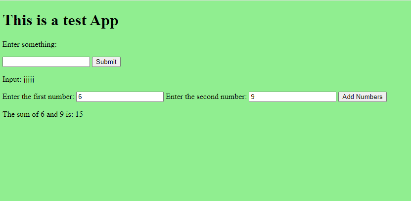

# testApp

Kokeilen yhdistää go, html, css ja js.

## Idea

- Kirjoita "jotain" ja paina Submit -nappia, niin "jotain" ilmestyy sen alle
- Syötä kaksi numeroa, niin ohjelma laskee ne yhteen

## Mitä pitää tehdä

1. 
```
go run main.go
```
2. 
```
http://localhost:8080/
```
